# Aircraft Birdstrike Analysis - Visual Interpretation Guide

This document provides detailed interpretations of all visualizations generated from the aircraft birdstrike dataset analysis, covering 50,543 wildlife strike incidents from 1990-2015.

## Table of Contents

1. [Time Series Analysis](#time-series-analysis)
2. [Operator and Aircraft Analysis](#operator-and-aircraft-analysis)
3. [Geographic Analysis](#geographic-analysis)
4. [Wildlife Species Analysis](#wildlife-species-analysis)
5. [Flight Operations Analysis](#flight-operations-analysis)
6. [Cost and Damage Analysis](#cost-and-damage-analysis)

---

## Time Series Analysis

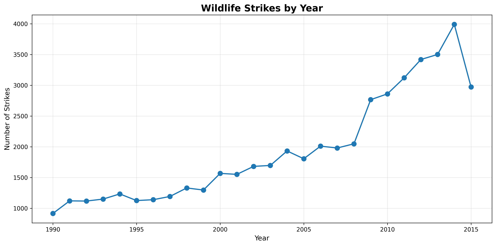

**Interpretation:**
- **Upward Trend**: The graph shows a clear and concerning upward trend in wildlife strikes from 1990 to 2015
- **Significant Increase**: Strikes increased from approximately 916 annually in the early 1990s to nearly 4,000 by 2015
- **Growth Rate**: This represents a more than 4x increase over the 25-year period
- **Possible Causes**: 
  - Increased air traffic volume
  - Better reporting systems
  - Growing wildlife populations near airports
  - Enhanced awareness and mandatory reporting

**Key Insight**: The dramatic increase suggests wildlife strikes are a growing aviation safety concern that requires ongoing attention and mitigation efforts.

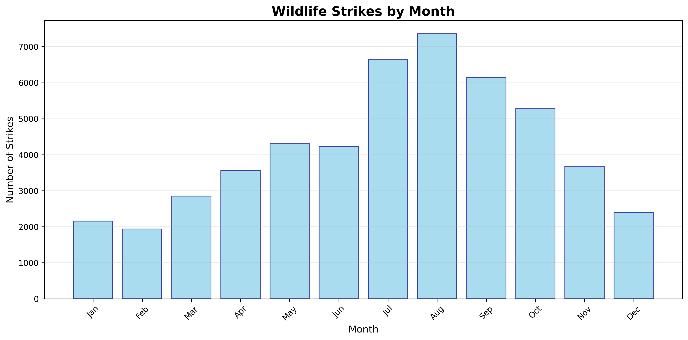

**Interpretation:**
- **Seasonal Pattern**: Clear seasonal variation with peak activity during summer months
- **Peak Month**: August experiences the highest number of strikes (7,359 incidents)
- **Low Period**: Winter months (December-February) show the lowest strike frequency
- **Summer Surge**: July-August period accounts for approximately 30% of all annual strikes

**Key Insight**: The seasonal pattern correlates with bird migration patterns and breeding seasons, suggesting seasonal wildlife management strategies should be implemented.

---

## Operator and Aircraft Analysis

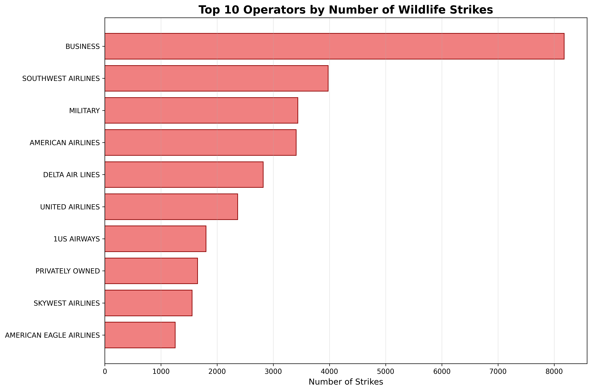

**Interpretation:**
- **Business Aviation**: "BUSINESS" operators lead with 8,177 strikes, indicating high exposure due to frequent operations
- **Major Airlines**: Southwest, American, and United Airlines show significant numbers, reflecting their large fleet sizes and flight frequencies
- **Military Operations**: Military operations appear in the top 10, highlighting risks during training and operational flights

**Key Insight**: The distribution correlates with flight volume and operational patterns, suggesting risk mitigation should be proportional to operational intensity.

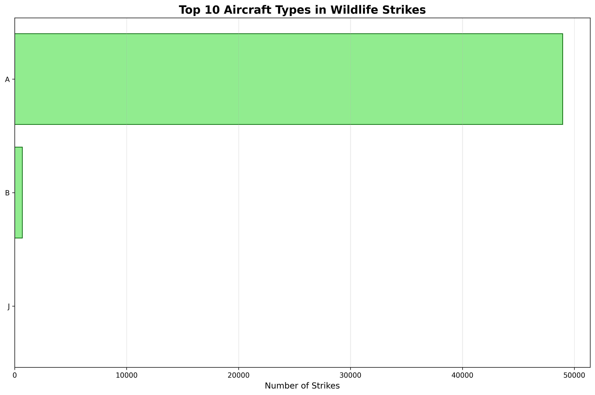

**Interpretation:**
- **Type A Dominance**: Type A aircraft (likely commercial jets) account for 48,957 strikes - the vast majority
- **Commercial Aviation Focus**: The data heavily represents commercial aviation operations
- **Fleet Representation**: The distribution reflects the composition of the US aircraft fleet

**Key Insight**: Commercial aircraft are most frequently involved, likely due to their numbers and operational patterns in wildlife-rich environments.

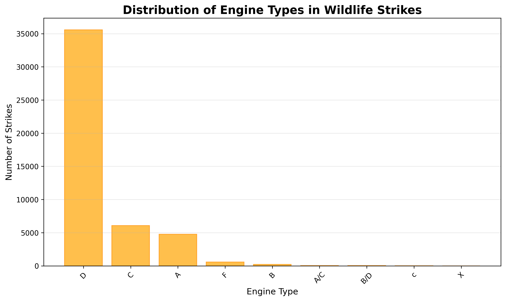

**Interpretation:**
- **Type D Engines**: Type D engines (likely turbofan) dominate with 35,567 strikes
- **Jet Engine Prevalence**: The high number of Type D engines reflects the prevalence of jet aircraft in commercial aviation
- **Engine Vulnerability**: Jet engines may be more susceptible to wildlife ingestion due to their design

**Key Insight**: Jet engine design and wildlife ingestion protection should remain a priority for aircraft manufacturers.

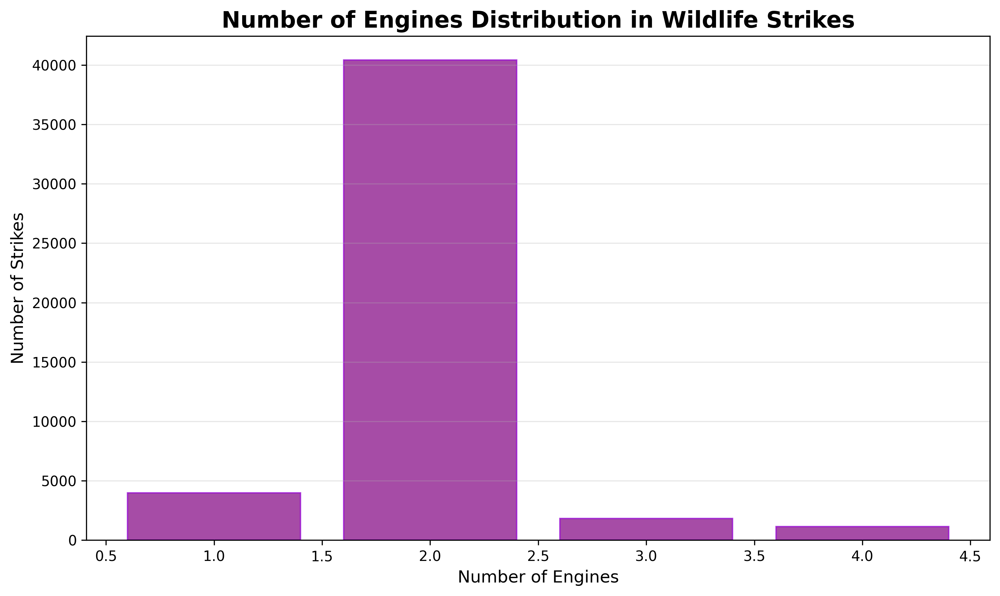

**Interpretation:**
- **Twin-Engine Dominance**: Aircraft with 2 engines account for 40,420 strikes (80%+ of incidents)
- **Modern Fleet Profile**: Reflects the current trend toward twin-engine aircraft in commercial aviation
- **Risk Exposure**: More engines potentially mean higher strike probability, but twin-engine design is standard for modern commercial aircraft

**Key Insight**: The twin-engine configuration's dominance reflects modern aviation fleet composition and associated wildlife strike exposure.

---

## Geographic Analysis

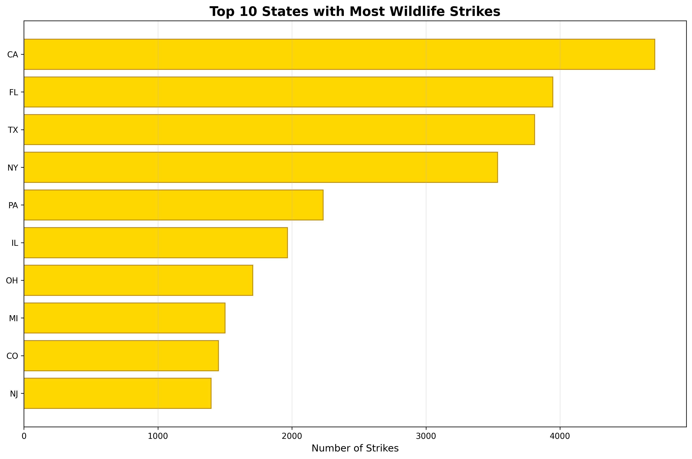

**Interpretation:**
- **California Leadership**: California leads with 4,707 strikes, likely due to:
  - Large number of airports
  - Diverse wildlife populations
  - High flight traffic volume
  - Favorable climate year-round
- **Florida and Texas**: Southern states with high aviation activity and wildlife diversity
- **Geographic Distribution**: Coastal and southern states dominate, reflecting both aviation traffic and wildlife habitats

**Key Insight**: Geographic risk assessment should focus on high-traffic states with diverse wildlife populations.

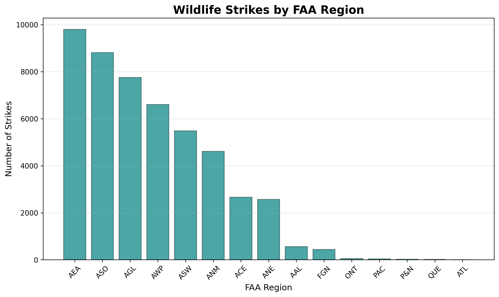

**Interpretation:**
- **AEA Region Dominance**: AEA (Eastern) region leads with 9,797 strikes
- **Regional Variation**: Significant differences between FAA regions reflect:
  - Varying traffic volumes
  - Different wildlife habitats
  - Regional reporting practices
  - Climate and geographic factors

**Key Insight**: FAA regions should develop region-specific wildlife management strategies based on local risk factors.

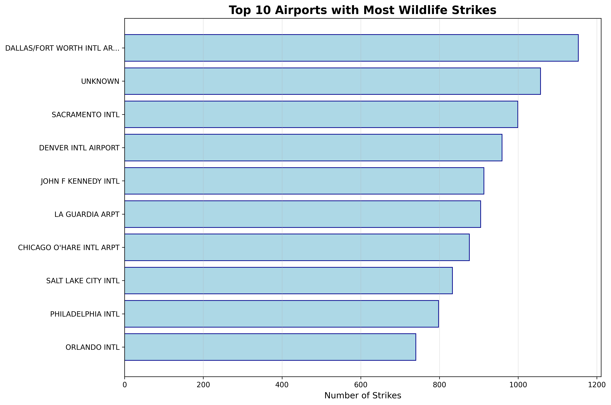

**Interpretation:**
- **Dallas/Fort Worth Leadership**: DFW airport leads with 1,153 strikes, likely due to:
  - High traffic volume (one of world's busiest airports)
  - Large geographic footprint
  - Texas wildlife diversity
  - Year-round operations
- **Major Hub Airports**: The list represents major commercial aviation hubs with high traffic volumes

**Key Insight**: High-traffic airports require enhanced wildlife management programs proportional to their operational intensity.

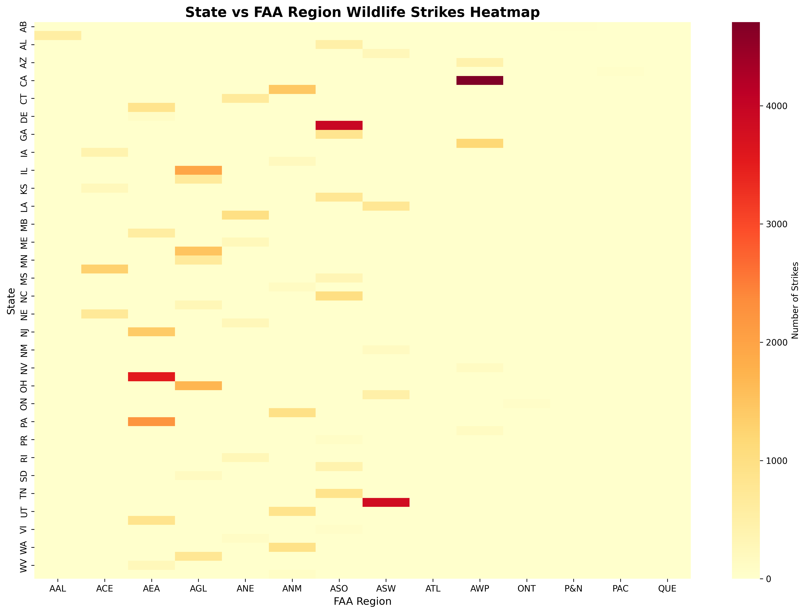

**Interpretation:**
- **Regional Patterns**: The heatmap reveals clustering patterns between states and FAA regions
- **High-Intensity Areas**: Darker regions indicate higher strike concentrations
- **Administrative Boundaries**: Shows how wildlife strikes align with FAA administrative divisions
- **Resource Allocation**: Helps identify where wildlife management resources should be focused

**Key Insight**: The geographic clustering provides valuable information for regional wildlife hazard mitigation planning.

---

## Wildlife Species Analysis

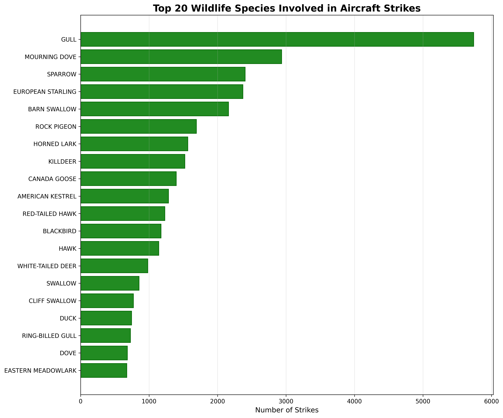

**Interpretation:**
- **Gull Dominance**: Gulls lead with 5,741 strikes, likely due to:
  - Coastal and inland waterway proximity to airports
  - Large population numbers
  - Soaring behavior that conflicts with aircraft operations
- **Bird Species Predominance**: All top 20 species are birds, reflecting the primary wildlife hazard
- **Common Species**: Mourning doves, pigeons, and sparrows indicate common urban/suburban wildlife involvement

**Key Insight**: Species-specific management strategies should focus on gulls and other common bird species frequenting airport environments.

---

## Flight Operations Analysis

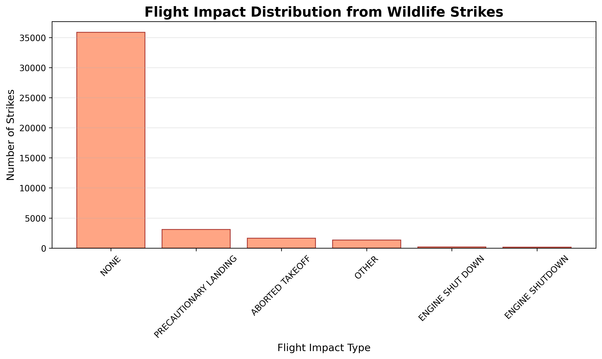

**Interpretation:**
- **No Damage Majority**: 35,883 strikes (84.8%) result in no damage, indicating most wildlife strikes are minor events
- **Precautionary Landings**: 3,097 incidents (7.3%) require precautionary landings, showing operational impact
- **Serious Incidents**: Engine shutdowns and aborted takeoffs represent serious but relatively rare events
- **Safety Margin**: The high percentage of no-damage incidents suggests aircraft are generally resilient to wildlife strikes

**Key Insight**: While most strikes cause no damage, the operational impact (precautionary landings) represents significant costs and disruptions.

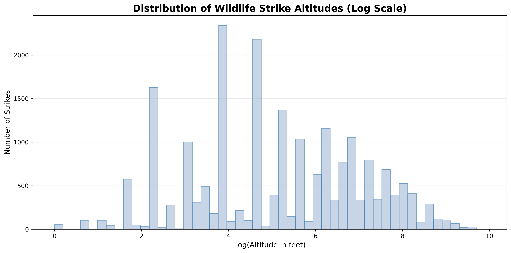

**Interpretation:**
- **Low-Altitude Concentration**: The log-scale distribution shows most strikes occur at low altitudes
- **Average Altitude**: Mean altitude of 776 feet with median of 200 feet indicates most strikes happen during takeoff/landing phases
- **Operational Correlation**: Low altitude strikes align with approach and departure phases where aircraft are closest to ground-level wildlife
- **Risk Window**: The altitude distribution helps define the critical risk window for wildlife encounters

**Key Insight**: Wildlife strike risk is concentrated below 1,000 feet, during the most critical phases of flight.

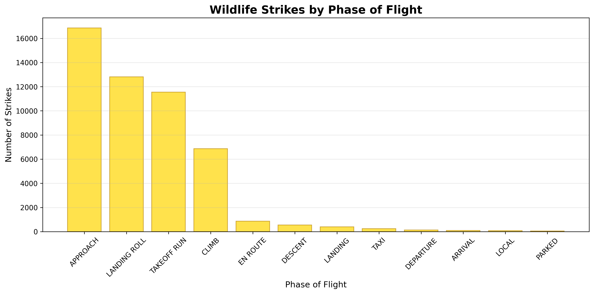

**Interpretation:**
- **Approach Phase Dominance**: 16,865 strikes occur during approach (33.4% of total)
- **Critical Phases**: Approach, landing roll, and takeoff run account for the majority of strikes
- **Low-Altitude Operations**: The distribution confirms that low-altitude phases present the highest wildlife strike risk
- **Operational Vulnerability**: Aircraft are most vulnerable during approach and departure when speed and altitude are changing

**Key Insight**: Enhanced wildlife detection and avoidance procedures should focus on approach and departure phases.

---

## Cost and Damage Analysis

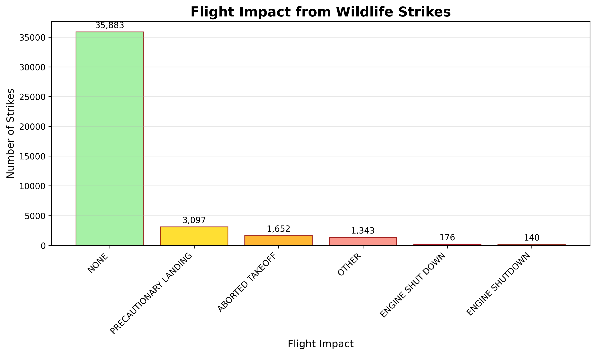

**Interpretation:**
- **Minimal Damage Prevalence**: The vast majority of strikes cause no or minimal damage
- **Economic Impact**: Even minor damage can result in significant costs through inspections, repairs, and operational disruptions
- **Safety Focus**: While serious damage is rare, the potential for catastrophic failure necessitates continued vigilance
- **Cost-Benefit Analysis**: The damage distribution supports investment in wildlife hazard mitigation

**Key Insight**: The economic impact of wildlife strikes extends beyond direct damage costs to include operational disruptions and preventive measures.

---

## Summary and Recommendations

### Key Patterns Identified:

1. **Temporal**: Increasing trend with summer peak
2. **Geographic**: Concentration in high-traffic, wildlife-rich areas
3. **Operational**: Low-altitude phases present highest risk
4. **Species**: Gulls and common birds most frequently involved
5. **Impact**: Most strikes cause no damage but create operational disruptions

### Strategic Implications:

- Wildlife strike risk is growing and requires systematic management
- Risk is concentrated in predictable patterns (seasonal, geographic, operational)
- Prevention strategies should focus on high-risk periods and locations
- Species-specific management can reduce strike frequency
- Even minor strikes have significant economic implications

This analysis provides a comprehensive foundation for developing targeted wildlife hazard mitigation strategies to enhance aviation safety.
